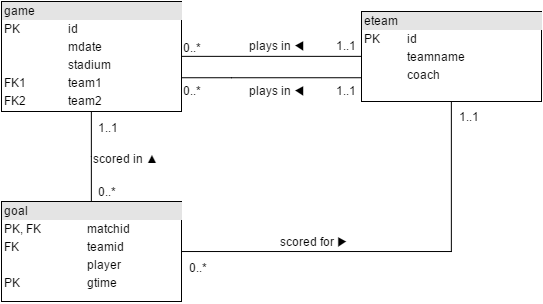

[The JOIN Operation](https://sqlzoo.net/wiki/The_JOIN_operation) solutions

**Entity Relationship Diagram** (ERD)


**More Difficult Questions-**  

8.  ##### Listing all the player who scored goals agains Germany  
    ##### MySql
    ```sql
    SELECT DISTINCT player
    FROM game JOIN goal ON matchid = id 
    WHERE (team1='GER' OR team2='GER') AND teamid != 'GER'
    ```
    - `DISTINCT` becuase there can be duplicated players, i.e the case where a player has scored goals against Germany multiple times in single/multiple games
    -   We only want the matches of Germany i.e, `(team1='GER' OR team2='GER')` and in those matches the players who scored goals against Germany `teamid != 'GER'`
  
9. ##### Listing all the teamnames with their no. of goals scored
   ##### MySql
   ```sql
   SELECT teamname, COUNT(teamid)
   FROM eteam JOIN goal ON id=teamid 
   GROUP BY teamid
   ORDER BY teamname
   ```
10. ##### Listing all the stadium and no. of goals scored in each stadium
    ##### MySql
    ```sql
    SELECT stadium, COUNT(stadium) FROM game JOIN goal ON id=matchid GROUP BY stadium
    ```
11. ##### No. of goals scored in Poland match  
    ##### MySql
    ```sql
    SELECT matchid, mdate, COUNT(matchid)
    FROM game JOIN goal ON matchid = id 
    WHERE (team1 = 'POL' OR team2 = 'POL')
    GROUP BY matchid
    ```

12. ##### For every match where Germany scored, find the no. of goals scored
    ##### MySql
    ```sql
    SELECT matchid, mdate, COUNT(matchid) 
    FROM game JOIN goal ON id=matchid 
    WHERE teamid='GER'
    GROUP BY matchid
    ```

13. ##### For every match list down the goals scored by each team as score1 and score2
    ##### MySql
    ```sql
    SELECT mdate, team1,
    SUM(CASE WHEN teamid=team1 THEN 1 ELSE 0 END) as score1,
    team2, 
    SUM(CASE WHEN teamid=team2 THEN 1 ELSE 0 END) as score2
    FROM game LEFT JOIN goal ON id=matchid
    GROUP BY id ORDER BY mdate, matchid, team1, team2
    ```
    - `CASE..` condition here helps to `SUM()` the individual team's total goal seperately within each `id/matchid` Group/partition
    - Ordering of `ORDER BY` columns doesn't matter