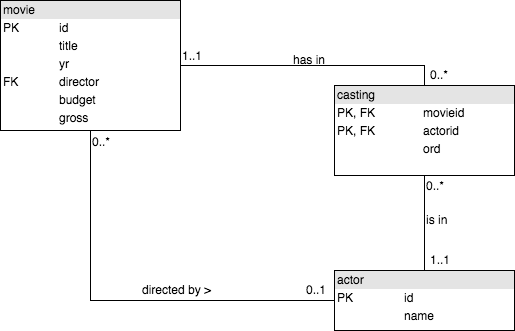

[More JOIN operations](https://sqlzoo.net/wiki/More_JOIN_operations) solutions

**Entity Relationship Diagram** (ERD)


6. ##### Cast list for movie `Casablanca`
   ##### MySql
    ```sql
    SELECT DISTINCT a.name
    FROM movie m JOIN casting c ON c.movieid=(SELECT id FROM movie WHERE title='Casablanca') JOIN actor a ON c.actorid=a.id
    ```
7. ##### Cast list for movie `Alien` 
   ##### MySql
   ```sql
   SELECT DISTINCT a.name FROM movie m JOIN casting c ON c.movieid=(SELECT id FROM movie WHERE title='Alien') JOIN actor a ON a.id=c.actorid
   ```

8. ##### listing films in which `Harrison Ford` appread
   ##### MySql
   ```sql
   SELECT m.title FROM movie m JOIN casting c ON m.id=c.movieid JOIN actor a ON a.id=c.actorid WHERE name='Harrison Ford'
   ```
9. ##### listing films in which `Harrison Ford` appread, but not as a starring role
   ##### MySql
   ```sql
   SELECT m.title FROM movie m JOIN casting c ON m.id=c.movieid JOIN actor a ON a.id=c.actorid WHERE name='Harrison Ford' AND c.ord <> 1
   ```

10. ##### lead actors of 1962 movies
    ##### MySql
    ```sql
    SELECT m.title, a.name FROM movie m JOIN casting c ON m.id=c.movieid JOIN actor a ON a.id=c.actorid 
    WHERE m.yr=1962 AND c.ord = 1   
    ```

#### Harder Problems
11. ##### find the busy yr (made more than 2 movies in a yr) for 'Rock Hudson'
    ##### MySql
    ```sql
    SELECT m.yr, COUNT(title) FROM movie m JOIN casting c ON m.id=c.movieid JOIN actor a ON c.actorid=a.id 
    WHERE a.name='Rock Hudson'
    GROUP BY a.name, m.yr
    HAVING COUNT(title) > 2
    ```
12. ##### Listing the lead actors of all the movies where 'Julie Andrews' played in
    ##### MySql
    ```sql
    SELECT title,name FROM movie JOIN casting ON 
    (id=movieid AND ord = 1)
    JOIN actor ON actorid=actor.id
    WHERE movie.id IN (
        SELECT movieid FROM casting
            WHERE actorid IN (
                SELECT id FROM actor
                    WHERE name='Julie Andrews'
        )
    ) 
    ```
13. ##### all the actors who have been as lead actors in atleast 15 times
    ##### MySql
    ```sql
    SELECT name FROM casting JOIN actor ON (
    actorid=id AND ord=1) GROUP BY name HAVING COUNT(name) >= 15
    ```

    Better way (faster performance)
    ```sql
    SELECT name FROM actor WHERE id IN(
    SELECT actorid FROM casting WHERE ord=1 GROUP BY actorid HAVING COUNT(actorid) >= 15 
    ) ORDER BY name
    ```

14. ##### listing all the films of 1978 order by their no. of casts, then by title
    ##### MySql
    ```sql
    SELECT title, COUNT(actorid) FROM movie JOIN casting ON (movie.id=movieid AND yr=1978) JOIN actor ON actorid=actor.id GROUP BY movieid ORDER BY COUNT(actorid) DESC, title
    ```
15. ##### co-actors of 'Art Garfunkel'
    ##### MySql
    ```sql 
    SELECT name FROM casting JOIN actor ON actorid = id AND  movieid IN (
    SELECT movieid FROM casting JOIN actor ON actorid=id WHERE name='Art Garfunkel'
    )
    WHERE name <> 'Art Garfunkel'
    ```
    ##### MySql (without JOIN, much performant)
    ```sql
    with cte AS (SELECT id FROM actor WHERE name='Art Garfunkel')

    SELECT name FROM actor WHERE id IN (
        SELECT actorid FROM casting WHERE movieid IN (
            SELECT movieid FROM casting WHERE actorid = (SELECT * from cte)
    ) AND actorid <> (SELECT id FROM cte))
    ```
    - first list all the movieid where 'Art Garfunkel' played in
    - then find all the actorid != id('Art Garfunkel')
  